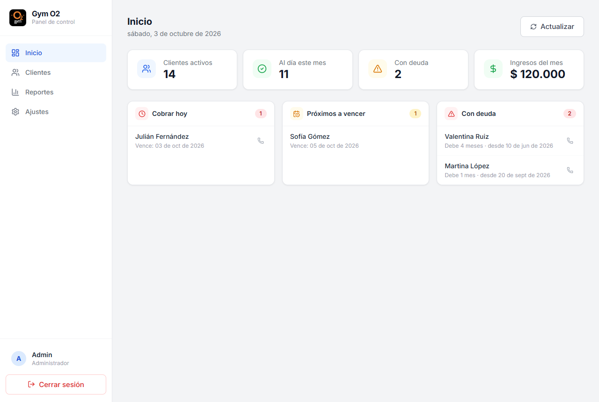
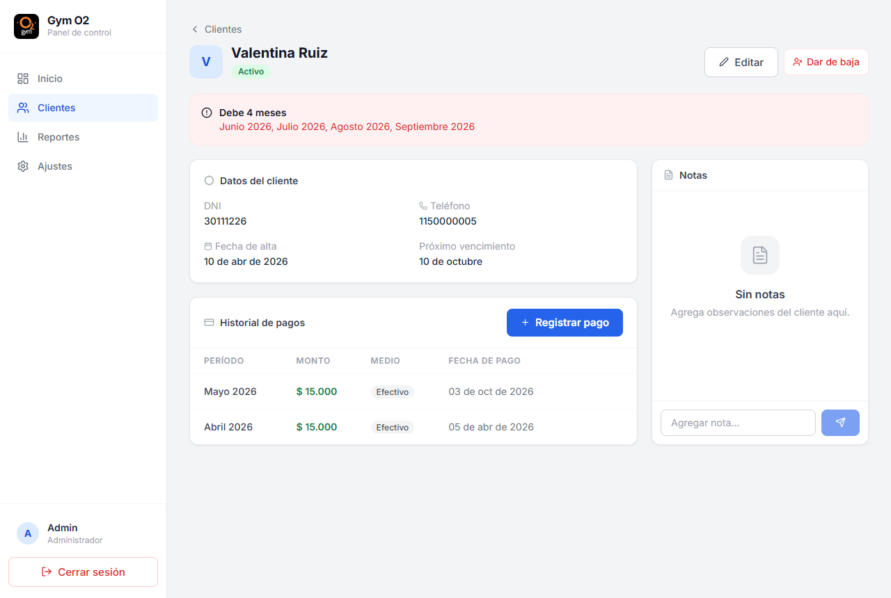
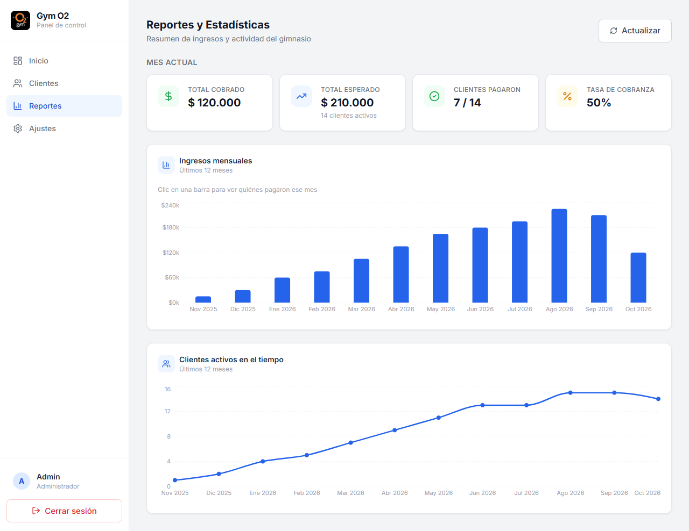
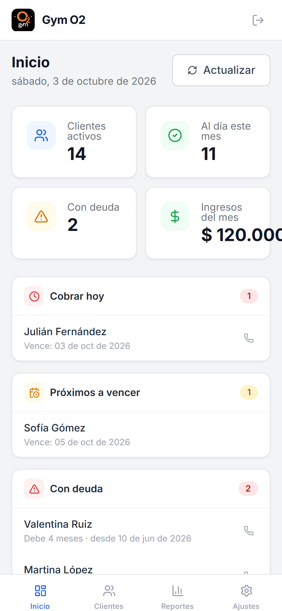
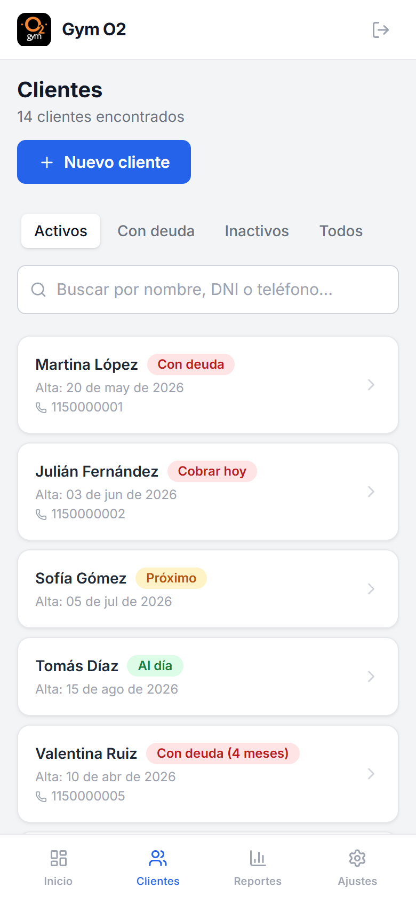

# GymManager

Aplicación web para gestionar un gimnasio de barrio: reemplaza la libreta de papel donde se anotaban clientes y cuotas por un sistema que avisa cada día a quién cobrarle, quién debe y cuánto se recaudó.

La usa una sola persona (el dueño), desde la PC del gimnasio o desde el celular.



## Qué resuelve

Con la libreta, saber quién debía implicaba revisar página por página. Ahora:

- **Dashboard diario**: quién vence hoy, quién vence en los próximos días y quién debe, con un botón para llamarlo.
- **Deuda real**: se revisan todos los meses desde el alta, no solo el actual. Si alguien no pagó mayo, figura con deuda aunque junio todavía no le haya vencido.
- **Historial por cliente**: datos de contacto, pagos (con medio de pago) y notas.
- **Reportes**: ingresos de los últimos 12 meses (clic en una barra para ver quién pagó), evolución de clientes activos y tasa de cobranza del mes.
- **Configuración**: precio de la cuota, días de aviso antes del vencimiento y cambio de contraseña.

| Detalle de cliente con deuda | Reportes |
| --- | --- |
|  |  |

| Dashboard en el celular | Clientes en el celular |
| --- | --- |
|  |  |

> Las capturas usan datos ficticios.

## Stack

| Capa | Tecnología |
| --- | --- |
| Frontend | React 19, TypeScript, Vite, Tailwind CSS, Recharts |
| Backend | Node.js, Express, TypeScript, Zod |
| Base de datos | PostgreSQL con Prisma (ORM y migraciones) |
| Autenticación | JWT en cookie HTTP-only, bcrypt |
| Calidad | ESLint, Vitest, GitHub Actions |
| Deploy | Vercel (frontend), Render (API), Neon (PostgreSQL) |

## Arquitectura

```text
Navegador (PC o celular)
   │  https://<app>.vercel.app
   ▼
Vercel ── sirve el frontend y reescribe /api/* hacia Render (mismo origen para el navegador)
   │
   ▼
Render ── API Express
   │        Route → Controller → Service → Repository → Prisma
   ▼
Neon ──── PostgreSQL
```

El backend está separado en capas con responsabilidades fijas:

- **Controllers**: validan la entrada con Zod (body, query y params) y responden. Sin lógica de negocio ni `try/catch`: un `asyncHandler` pasa los errores a un middleware central que responde siempre `{ success: false, message }`.
- **Services**: reglas de negocio (vencimientos, deuda, reportes).
- **Repositories**: la única capa que habla con Prisma.
- **utils**: funciones puras (fechas, clasificación de clientes) cubiertas con tests.

El frontend separa `pages`, `components`, `hooks`, `services`, `types` y `utils`. Los datos se cargan con un hook genérico (`useApiData`).

## Decisiones técnicas

- **Cookie HTTP-only + proxy de Vercel en vez de token en `localStorage`.** El JWT no es accesible desde JavaScript (protege ante XSS). Como Vercel reenvía `/api/*` a Render, front y API comparten origen y la cookie puede ser `SameSite=Strict`, que bloquea CSRF sin tokens extra.
- **Sesiones revocables.** La sesión dura 30 días (pedido del PRD: no loguearse en cada visita), pero el usuario tiene un `tokenVersion` que viaja dentro del JWT. Cambiar la contraseña lo incrementa e invalida todas las sesiones abiertas, por ejemplo la de un celular perdido.
- **Login protegido contra fuerza bruta.** Rate limit de 5 intentos fallidos cada 15 minutos por IP y un tope global por hora, contraseñas de 12+ caracteres y secretos obligatorios: el servidor no arranca si `JWT_SECRET` falta o es corto.
- **Errores sin filtrar internos.** Los 500 devuelven un mensaje genérico; el detalle (Prisma, tablas, campos) queda solo en el log.
- **"Hoy" en hora de Argentina.** El servidor corre en UTC; sin corregirlo, desde las 21 h ya sería "mañana" y el dashboard mostraría los vencimientos del día siguiente. Las fechas se calculan con `America/Argentina/Buenos_Aires`.
- **Vencimiento a fin de mes.** Un cliente que se dio de alta el 31 vence el 30 en abril y el 28 (o 29) en febrero.
- **Deuda desde el alta o la última reactivación.** A un cliente reactivado no se le cobran los meses en que estuvo de baja.
- **Historial de bajas.** Se guardan la fecha de la última baja y de la última reactivación, así el gráfico de clientes activos muestra cuántos había realmente en cada mes (antes la curva nunca bajaba).
- **Lo cobrado se cuenta siempre.** Los ingresos de un mes incluyen pagos de clientes que después se dieron de baja, para que la tarjeta del mes y el gráfico coincidan.
- **Sin sobreingeniería.** Es un solo gimnasio con un solo usuario y menos de 500 clientes: un monolito Express, cálculos en memoria y sin caché ni colas.

### Limitaciones conocidas

- Solo se guarda la **última** baja y reactivación de cada cliente; si se dio de baja varias veces, los períodos anteriores no se reflejan en el gráfico.
- Los clientes dados de baja antes de que existiera la fecha de baja no tienen fecha conocida y no aparecen en la evolución histórica.
- Los clientes migrados desde la libreta necesitan sus pagos anteriores cargados; si no, figuran con deuda desde su fecha de alta.

## Correr en local

Requisitos: Node.js 20.19+ (o 22.12+) y PostgreSQL.

```bash
git clone https://github.com/LautaroSalvador/GymManager.git
cd GymManager
npm install
```

Crear `backend/.env` a partir del ejemplo y completar `DATABASE_URL`, `JWT_SECRET` (32+ caracteres) y `ADMIN_PASSWORD` (12+ caracteres):

```bash
cp backend/.env.example backend/.env
```

Crear las tablas y el usuario `admin`:

```bash
cd backend
npx prisma migrate deploy
npm run prisma:seed
cd ..
```

Levantar API (puerto 3000) y frontend (puerto 5173):

```bash
npm run dev:backend
```

```bash
npm run dev:frontend
```

Abrir http://localhost:5173 e ingresar con `admin` y la `ADMIN_PASSWORD` elegida. En desarrollo, Vite reenvía `/api` al backend, así que el frontend no necesita variables de entorno.

Opcional: `npx ts-node prisma/seed-test-data.ts` (desde `backend/`) carga clientes de ejemplo.

## Calidad

```bash
npm run lint
```

```bash
npm test
```

```bash
npm run typecheck
```

- **Lint**: ESLint en backend y frontend, con `no-explicit-any` como error.
- **Tests**: Vitest sobre la lógica de fechas, la clasificación de clientes (incluida la deuda de meses anteriores) y el historial de altas y bajas.
- **CI**: GitHub Actions corre lint, tipos, tests y el build del frontend en cada push y pull request ([`.github/workflows/ci.yml`](.github/workflows/ci.yml)).

## Estructura

```text
backend/
├── prisma/            # schema, migraciones y seeds
├── src/
│   ├── routes/        # endpoints y middlewares por recurso
│   ├── controllers/   # validación de entrada y respuesta
│   ├── services/      # reglas de negocio
│   ├── repositories/  # acceso a datos (Prisma)
│   ├── validators/    # schemas de Zod
│   ├── middlewares/   # auth, rate limit, errores
│   └── utils/         # fechas, clasificación, helpers
└── tests/             # Vitest

frontend/src/
├── pages/             # una por pantalla
├── components/        # agrupados por dominio (clientes, pagos, reportes…)
├── hooks/             # carga de datos y auth
├── services/          # llamadas a la API
├── types/
└── utils/
```

La especificación funcional completa está en [`PRD.md`](PRD.md).
